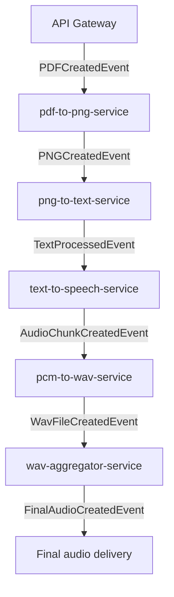

# Events

## Project Summary

This package defines the standardized, multi-tenant NATS message payloads for the book-expert microservices ecosystem.

## Detailed Description

This package establishes the explicit communication contract between microservices, ensuring a consistent and traceable data flow for the entire document processing pipeline. Adherence to these structures is mandatory for inter-service communication.

### Event Flow



### Event Payloads

#### EventHeader

| Field | Type | Description |
| ----- | ---- | ----------- |
| `Timestamp` | `time.Time` | RFC3339 timestamp representing when the event was emitted. |
| `WorkflowID` | `string` | Unique identifier for the workflow within the tenant. |
| `UserID` | `string` | Identifier of the user who initiated or owns the workflow. |
| `TenantID` | `string` | Tenant identifier for multi-tenant isolation. |
| `EventID` | `string` | Unique identifier for the event instance, used for traceability. |

#### PDFCreatedEvent

| Field | Type | Description |
| ----- | ---- | ----------- |
| `Header` | `EventHeader` | Mandatory metadata common to all events. |
| `PDFKey` | `string` | Object store key pointing to the uploaded PDF ready for processing. |

#### PNGCreatedEvent

| Field | Type | Description |
| ----- | ---- | ----------- |
| `Header` | `EventHeader` | Mandatory metadata common to all events. |
| `PNGKey` | `string` | Object store key for the generated PNG image. |
| `PageNumber` | `int` | One-based index of the processed page within the original document. |
| `TotalPages` | `int` | Total number of pages detected in the original PDF. |

#### TextProcessedEvent

| Field | Type | Description |
| ----- | ---- | ----------- |
| `Header` | `EventHeader` | Mandatory metadata common to all events. |
| `PNGKey` | `string` | Object store key for the source PNG image. |
| `TextKey` | `string` | Object store key for the OCR or augmented text payload. |
| `PageNumber` | `int` | One-based index of the processed page within the original document. |
| `TotalPages` | `int` | Total number of pages detected in the original PDF. |
| `Voice` | `string` | Optional voice identifier for downstream text-to-speech synthesis. |
| `Seed` | `int` | Optional randomization seed applied by downstream synthesis components. |
| `NGL` | `int` | Optional number of layers to offload to GPU accelerators. |
| `TopP` | `float64` | Optional nucleus sampling value guiding probabilistic text generation. |
| `RepetitionPenalty` | `float64` | Optional penalty applied to repeated tokens during generation. |
| `Temperature` | `float64` | Optional temperature parameter influencing sampling randomness. |

#### AudioChunkCreatedEvent

| Field | Type | Description |
| ----- | ---- | ----------- |
| `Header` | `EventHeader` | Mandatory metadata common to all events. |
| `AudioKey` | `string` | Object store key for the generated audio chunk. |
| `PageNumber` | `int` | One-based index of the processed page within the original document. |
| `TotalPages` | `int` | Total number of pages detected in the original PDF. |

#### WavFileCreatedEvent

| Field | Type | Description |
| ----- | ---- | ----------- |
| `Header` | `EventHeader` | Mandatory metadata common to all events. |
| `WavKey` | `string` | Object store key for the generated WAV file. |
| `PageNumber` | `int` | One-based index of the processed page within the original document. |
| `TotalPages` | `int` | Total number of pages detected in the original PDF. |

#### FinalAudioCreatedEvent

| Field | Type | Description |
| ----- | ---- | ----------- |
| `Header` | `EventHeader` | Mandatory metadata common to all events. |
| `FinalAudioKey` | `string` | Object store key pointing to the assembled final audio artifact. |

## Technology Stack

- **Programming Language:** Go 1.25

## Getting Started

### Prerequisites

- Go 1.25 (macOS: `brew install go@1.25`, Ubuntu: `sudo apt-get install -y golang-1.25-go`)

### Installation

1. `git clone https://github.com/book-expert/events.git`
2. `cd events`
3. `go mod tidy`

## Usage

To use the event structures, import the package into your Go project:

```go
import "github.com/book-expert/events"

// Example of creating a PDFCreatedEvent
event := events.PDFCreatedEvent{
    Header: events.EventHeader{
        Timestamp:  time.Now(),
        WorkflowID: "workflow-123",
        UserID:     "user-456",
        TenantID:   "tenant-789",
        EventID:    "event-abc",
    },
    PDFKey: "tenants/tenant-789/workflows/workflow-123/original.pdf",
}
```

## Testing

Run the standard Go test command to ensure the package compiles successfully:

```bash
go test ./...
```

A successful run exits with status code `0` and produces no failing test output.

## License

Distributed under the MIT License. See the `LICENSE` file for more information.
